<h1 align="center"> Live Slide</h1>   

 &nbsp;

<!-- START doctoc generated TOC please keep comment here to allow auto update -->
<!-- DON'T EDIT THIS SECTION, INSTEAD RE-RUN doctoc TO UPDATE -->

## Table of Contents

- [Table of Contents](#table-of-contents)
- [Introduction](#introduction)
- [Navigation](#navigation)
- [Screenshots](#screenshots)
- [System Requirements](#system-requirements)
- [Technologies](#technologies)

<!-- END doctoc generated TOC please keep comment here to allow auto update -->

 

## Introduction

Classroom presenter is a real-time synchronized presentation application. Participant's client is synchronized presenter's client in real time . Whatever presenter do , participant can see on their clients as well. The type of data which sending/receiving are not video like Teams or Zoom but primitive data.

 

## Navigation

Backend : 
Frontend : 
 

## Screenshots

* Login Page   
   &nbsp;

* Host ID Alert   
  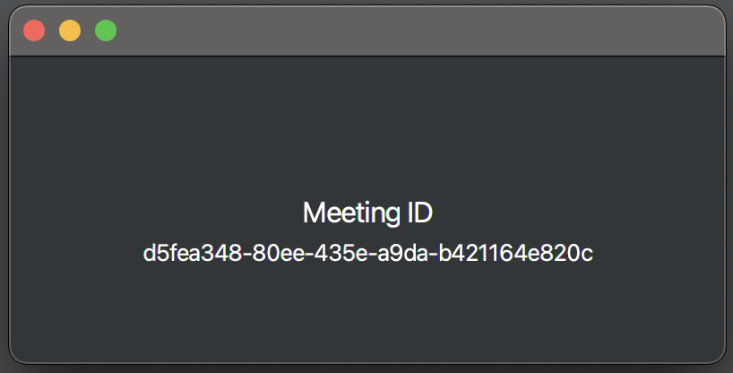 &nbsp;

* PDF Viewer Features   
  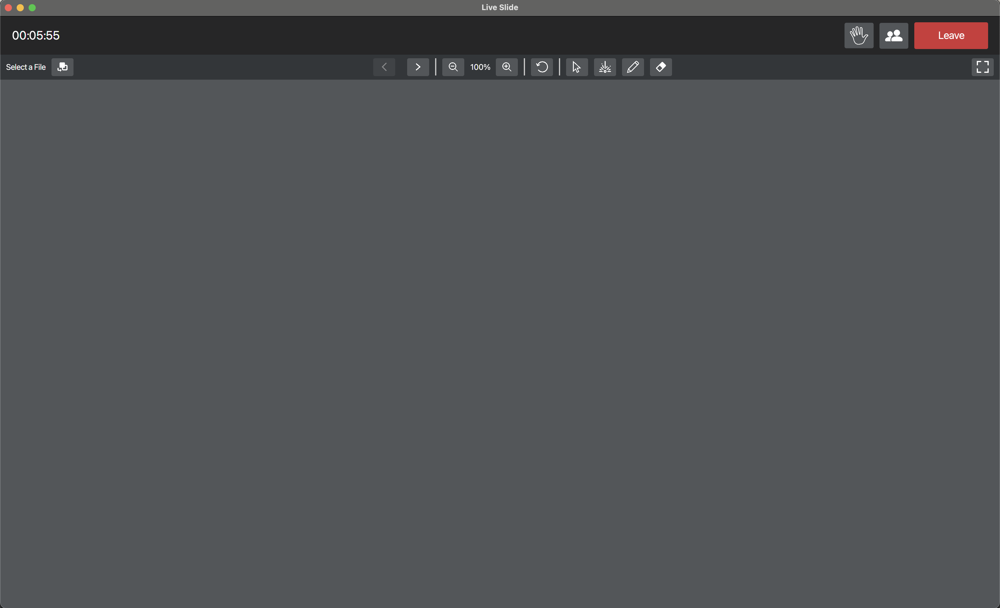
  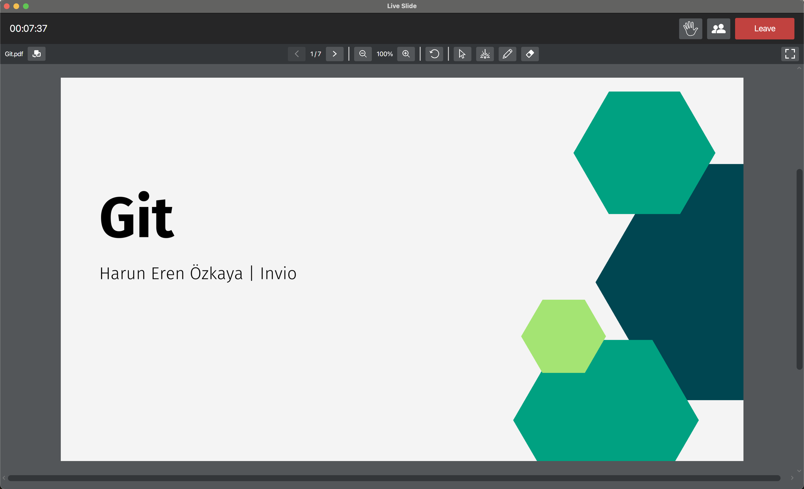
  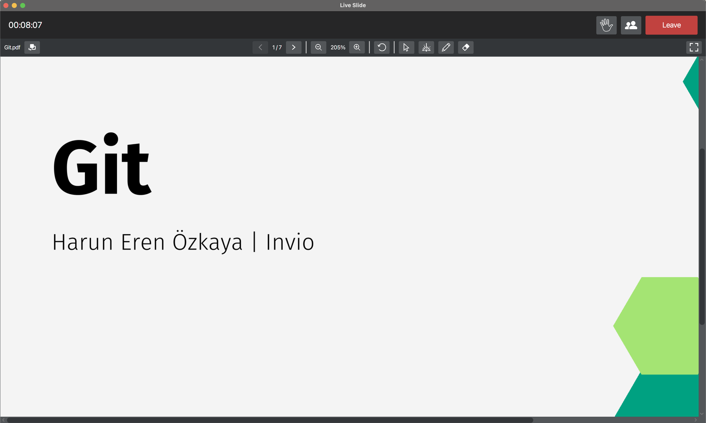
* 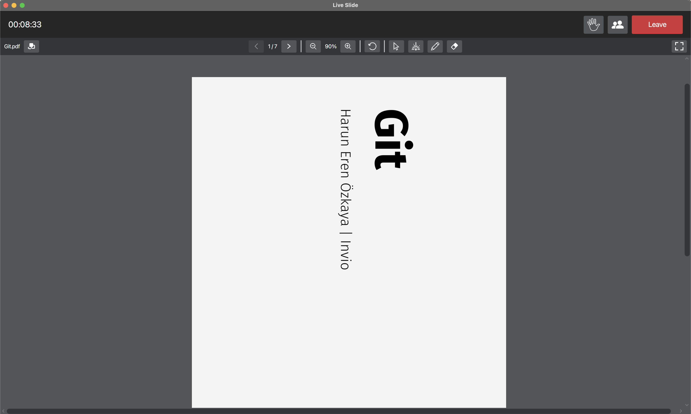
  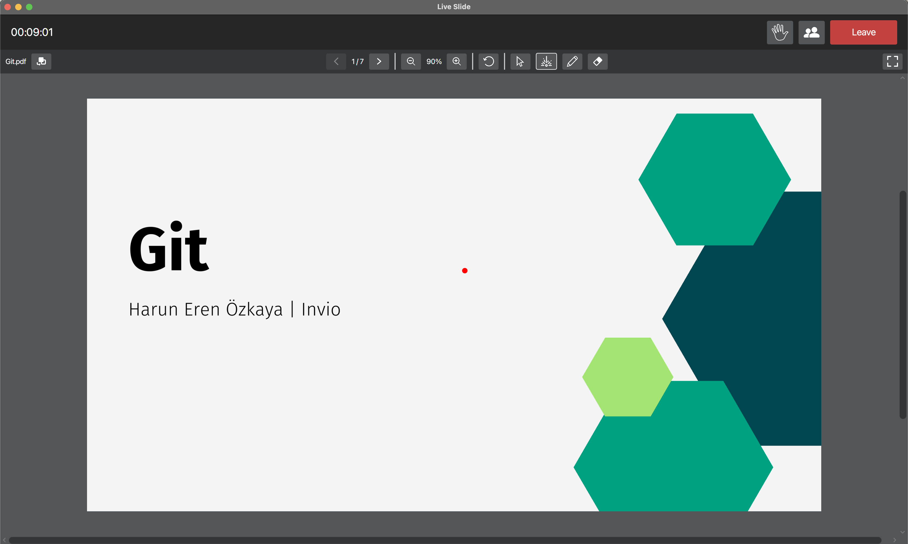
  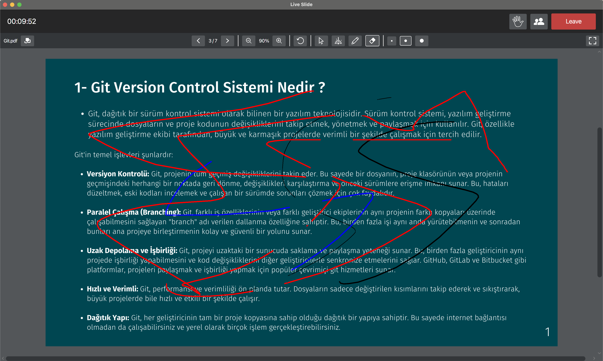

* Meeting Screen Features   
  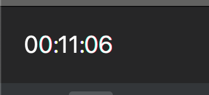
  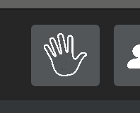
  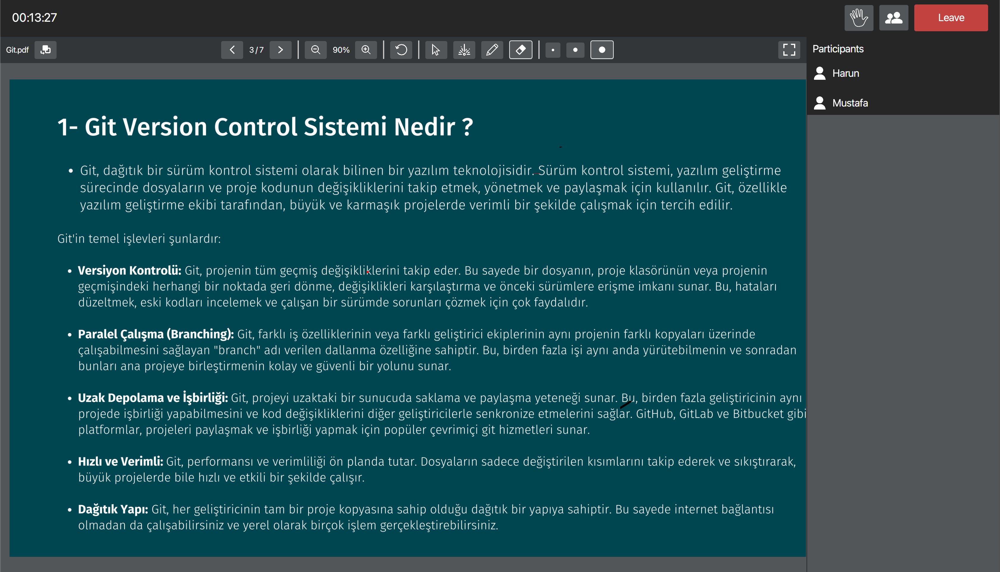

* Async Between Host and Participant   
  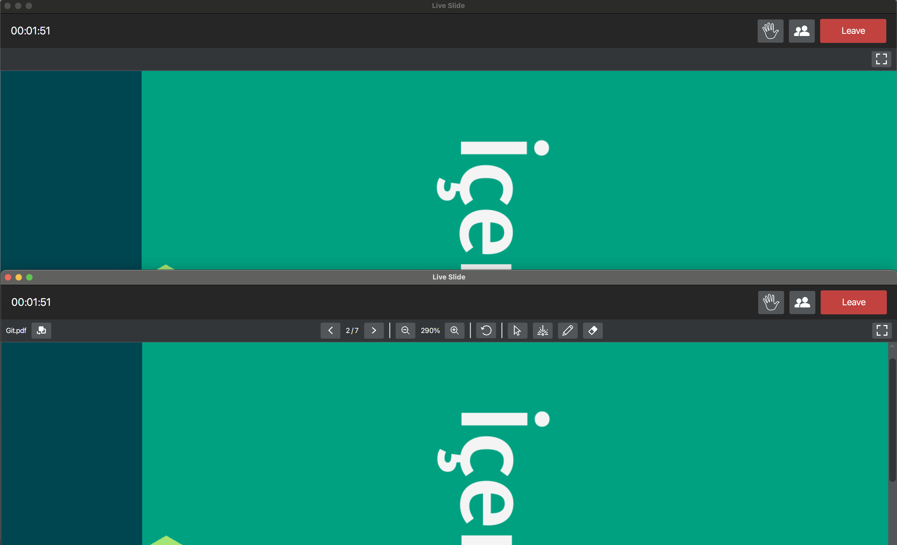
   
  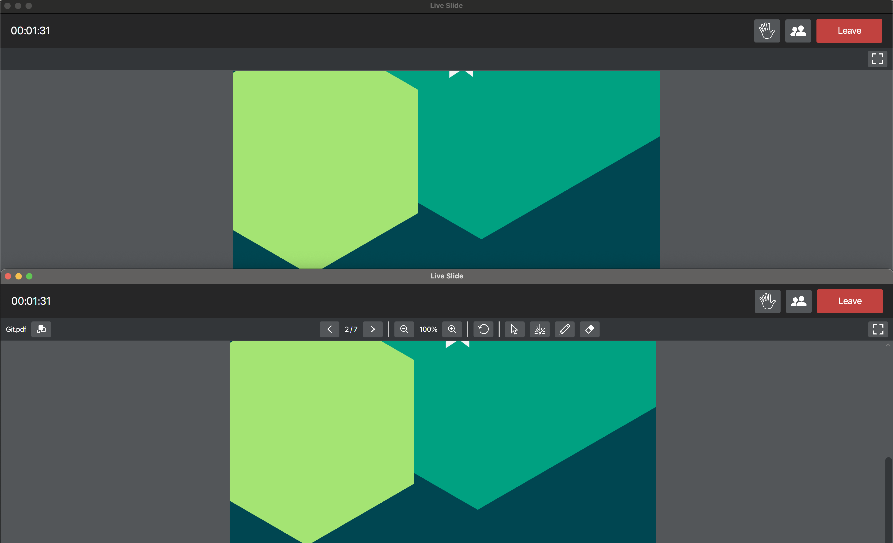
   
  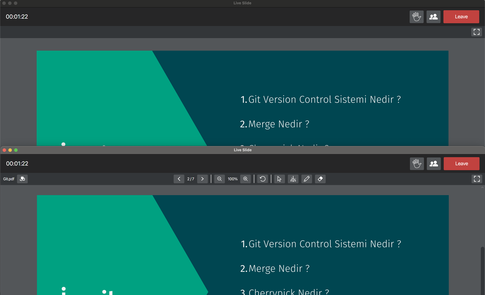

## System Requirements

- Java 11
- JavaFX
- Spring Boot 3.2.1
- Spring WebSocket
- AWS S3 SDK

## Technologies

- Java
- Spring Boot
- Spring WebSocket
- JavaFX
- AWS S3
